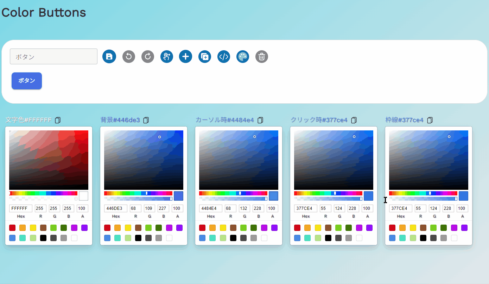
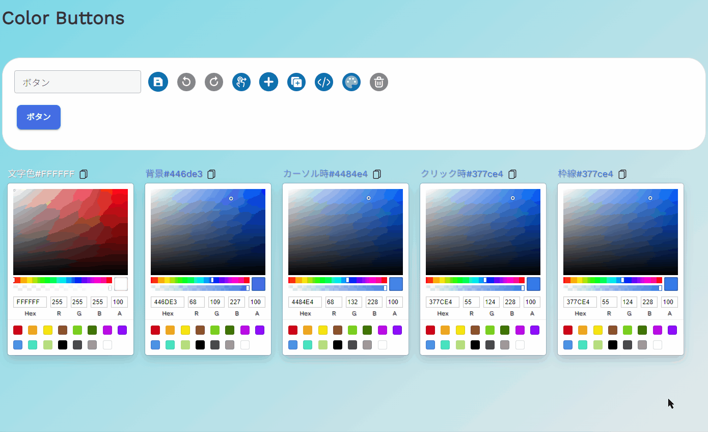

## 概要

様々なボタンを作って、カスタマイズして、コード化できる [Web サイト](https://yuu-oishi.github.io/color-pickers/)です！

## 機能

- 基本機能
  <br>
  テキスト変更、ボタンの色変更、ランダムボタン追加、複製、削除、背景色変更ができます。

## 

---

- 保存、ロード機能
  <br>
  現在のボタンの状態を保存します。次回ブラウザからのアクセス時、ロードするか聞かれるので、「はい」を押すと保存していたデータが読込まれます。ブラウザ側ローカルストレージに保存しているので、ブラウザキャッシュを削除するとデータも消えます。
  <br>
  最後に保存したデータから変更が無い場合は保存ボタンはグレーアウトされて押すことができなくなります。

## 

---

- ドラッグ・ドロップによる入替え機能
  <br>
  ドラッグ入替え機能ボタンを押すことで、ボタンの配置をドラッグで移動することが可能になります。再度入替え機能ボタンを押すことで入替えモードが終了し、選択モードに戻ります。戻る・進むボタンも有効で、入れ替えた順番を戻ったり進むことができます。

## 

- 戻る・進むボタン
  <br>
  各操作を取り消したり、取り消したものを再実行することができます。以下の操作が有効となる操作です。
  <br>
  ボタンテキスト変更、ボタンカラー変更、ドラッグによる配置入替え、ボタン選択、ランダムボタン追加、ボタン複製、背景色変更、ボタン削除
  <br>
  戻る操作、進む操作が無い場合はグレーアウトされて操作は実行されません。

## 

---

## 使用技術

- React, Typescript, Vite
- MUI (基本 UI)
- dnd-kit (ドラッグ、ドロップ機能)
- react-color (カラーピッカー)
- Recoil (ステート管理)

## 個人用メモ

svg の型定義 (import エラー回避)

```
# /custom.d.ts
declare module "*.svg" {
  const content: any;
  export default content;
}
```

```
# tsconfig.json

"include": ["src", "custom.d.ts"],
```
